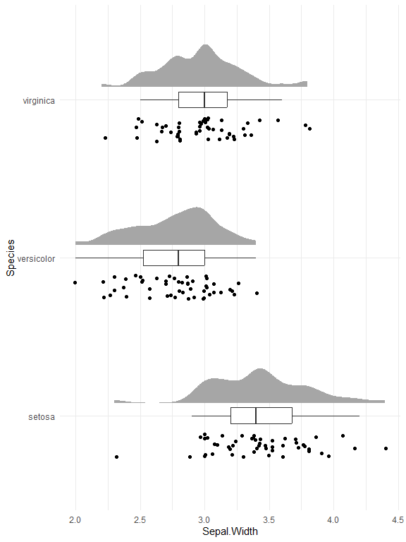
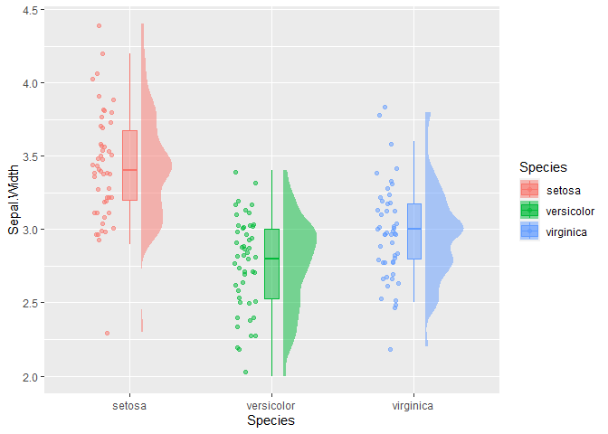

<!-- README.md is generated from README.Rmd. Please edit that file -->

# ggraincloud

<!-- badges: start -->
<!-- badges: end -->

The goal of ggraincloud is to …

## Installation

You can install the development version of ggraincloud from
[GitHub](https://github.com/) with:

``` r
# install.packages("pak")
pak::pak("bradfordjohnson/ggraincloud")
```

## Example

Create a raincloud plot using `raincloud()`.

``` r
library(ggraincloud)

raincloud(iris, ggplot2::aes(Species, Sepal.Width, color = Species, fill=Species), alpha = .5, flip_coords = TRUE)
```



``` r

raincloud(iris, ggplot2::aes(Species, Sepal.Width, color = Species, fill=Species), alpha = .5, flip_coords = FALSE)
```


