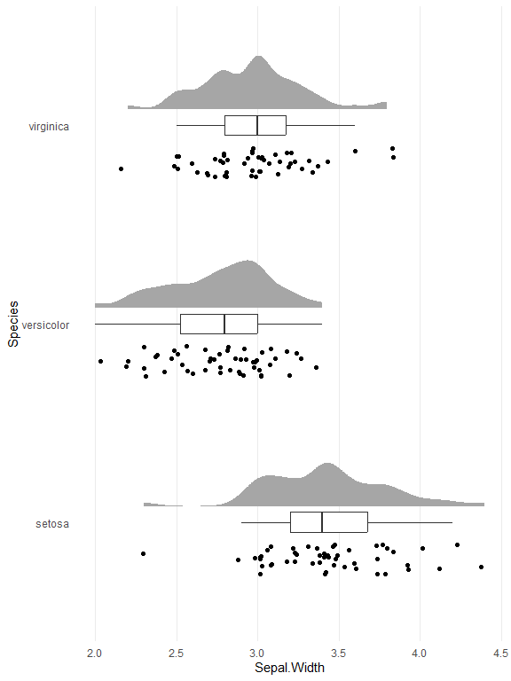
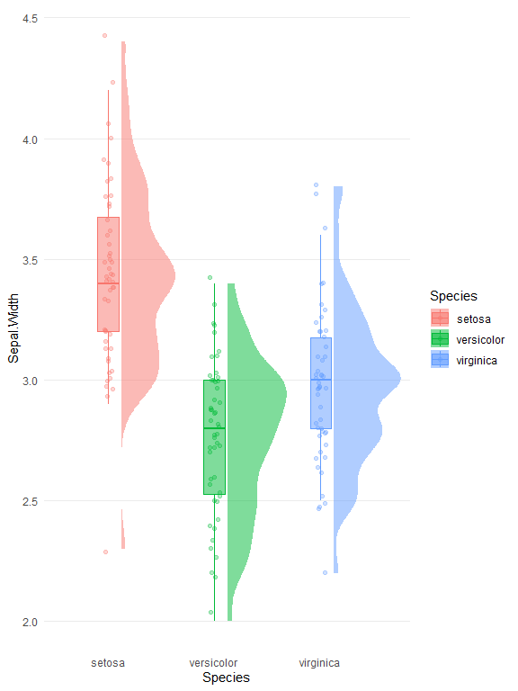

<!-- README.md is generated from README.Rmd. Please edit that file -->

# ggraincloud

<!-- badges: start -->

[](https://github.com/bradfordjohnson/ggraincloud/actions/workflows/R-CMD-check.yaml)
<!-- badges: end -->

**ggraincloud** is an R package that provides templated raincloud plots
using the grammar of graphics with `ggplot2`. It streamlines the
creation of visually appealing raincloud plots, combining density plots,
boxplots, and scatter plots for enhanced data visualization. Perfect for
users looking to create consistent and customizable raincloud plots
efficiently.

## Installation

You can install the development version of ggraincloud from
[GitHub](https://github.com/) with:

``` r
# install.packages("pak")
pak::pak("bradfordjohnson/ggraincloud")
```

## Examples

Create a raincloud plot using `raincloud()` and optionally style it with
`theme_raincloud()`.

``` r
library(ggraincloud)

plot <- raincloud(iris, ggplot2::aes(Species, Sepal.Width), flip_coords = TRUE) +
  theme_raincloud(flip_coords = TRUE)

plot
```

<!-- -->

Since the raincloud functions return a ggplot2 object, you can easily
customize the plot by adding additional ggplot2 layers and functions.

``` r
plot +
  ggplot2::theme_void()
```

<!-- -->

You can place the “rain” (jittered points) inside the boxplot using
`raincloud_boxjitter()`.

``` r
raincloud_boxjitter(
  iris,
  ggplot2::aes(
    Species,
    Sepal.Width,
    color = Species,
    fill = Species
  ),
  alpha = .5,
  flip_coords = FALSE
) +
theme_raincloud()
```

<!-- -->

## Acknowledgments

The `ggraincloud` package was inspired by the work of [Cédric
Scherer](https://www.cedricscherer.com/). His shared code snippets and
creative variations of raincloud plots in R sparked the idea to develop
this package, making it easier to quickly create raincloud plots using
ggplot2. A huge thanks to Cédric for his invaluable contributions to the
R and data visualization community!
